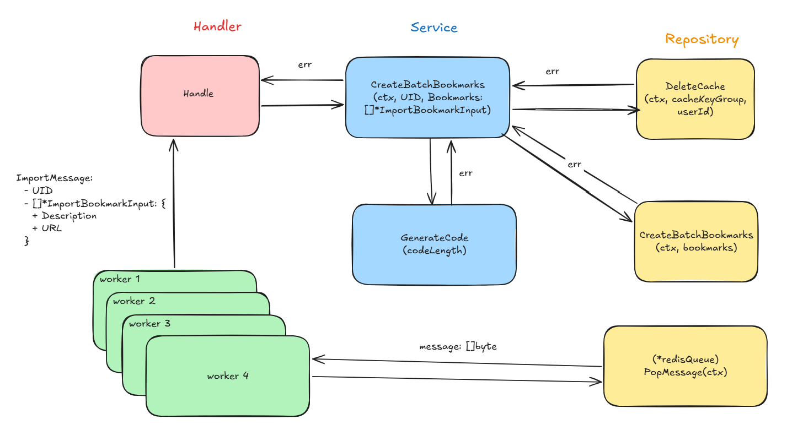

# worker-service

A background worker service that processes bookmark import jobs from a Redis queue, persists them to PostgreSQL, 
and invalidates the Redis cache so the API service always serves fresh data. Built with Go using Clean Architecture principles.

--- 

## Tech Stack

| Layer            | Tech Stack           |
|------------------|----------------------|
| Languague        | Go 1.26+             |
| Web Framework    | Gin                  |
| Database         | PostgreSQL + GORM    |
| Cache            | Redis                |
| Message Queue    | Redis                |
| Monitoring       | New Relic            |
| Containerization | Docker (multi-stage) |
| Logging          | Zerolog              |
| CI/CD            | Github Actions       |

---

## Project Structure

```
worker-service/
├── .github/workflows/       # CI/CD pipelines
├── bookmark-service/
│   └── .env                 # environment for bookmark-service
├── user-service/
│   └── .env                 # environment for user-service
├── postgres/                # DB initialization scripts
│   ├── init-db/             
│   │   └── 01_init_dbs.sql  # Initialize user and bookmark table
│   └── .env                 # environment for postgres
├── cmd/
│   └── worker/main.go       # API server entry point
├── internal/
│   ├── api/                 # Gin engine setup, routing, middleware
│   ├── app/
│   │   ├── handler/         # HTTP request handlers
│   │   ├── service/         # Business logic
│   │   ├── repository/      # Data access layer
│   │   └── model/           # Domain models
│   ├── infrastructure/      # Dependency injection, DB/Redis/JWT init
│   ├── integration_test/
│   │   ├── data/fixture/    # Shared test data and utilities
│   │   └── worker/          # Integration test for worker endpoint
│   └── worker/              # engine, worker pool, config
├── Dockerfile
├── docker-compose.yaml
├── Makefile
├── .env
├── .dockerignore
└── .gitignore
```

---

## Worker Workflow



---

## Getting Started

### Prerequisites

- [Go 1.26+](https://golang.org/)
- [Docker](https://www.docker.com/) & Docker Compose
- [Make](https://www.gnu.org/software/make/)

### 1. Set up worker service environment variables

| Variable                 | Default          | Description                                              |
|--------------------------|------------------|----------------------------------------------------------|
| `PREFIXENV_REDIS_ADDR`   | localhost:6379   | Redis server address used by the service.                |
| `PREFIXENV_DB_HOST`      | localhost        | PostgreSQL database host.                                |
| `PREFIXENV_DB_PORT`      | 5432             | PostgreSQL database port.                                |
| `PREFIXENV_DB_USER`      | admin            | PostgreSQL database username.                            |
| `PREFIXENV_DB_PASSWORD`  | admin            | PostgreSQL database password.                            |
| `PREFIXENV_DB_NAME`      | bookmark         | PostgreSQL database name.                                |
| `PREFIXENV_NR_APP_NAME`  | worker-service   | New Relic application name.                              |
| `PREFIXENV_NR_LICENSE`   |                  | New Relic license key.                                   |
| `PREFIXENV_NR_USER`      |                  | New Relic user or account identifier.                    |
| `PREFIXENV_LOG_LEVEL`    | info             | Global logging level.                                    |
| `PREFIXENV_SERVICE_NAME` | worker-service   | Name used to identify the service.                       |
| `PREFIXENV_INSTANCE_ID`  |                  | Unique identifier for the service instance.              |
| `PREFIXENV_QUEUENAME`    | bookmark-import  | Name of the queue.                                       |

### 2. Set up bookmark service environment variables

- [Bookmark Service Environment Setup](https://github.com/HemlockPham7/bookmark-service)

### 3. Set up user service environment variables

- [User Service Environment Setup](https://github.com/HemlockPham7/user-service)

### 4. Set up postgres environment variables

| Variable                 | Default          | Description                                              |
|--------------------------|------------------|----------------------------------------------------------|
| `POSTGRES_USER`          | admin            | PostgreSQL username used by the database container.      |
| `POSTGRES_PASSWORD`      | admin            | PostgreSQL password used by the database container.      |
| `POSTGRES_DB`            | bookmark         | PostgreSQL database name used by the database container. |
| `TZ`                     | Asia/Ho_Chi_Minh | Application timezone.                                    |

### 5. Start infrastructure (PostgreSQL + Redis)

```bash
docker-compose up redis postgres -d
```

### 6. Start service (user-service + bookmark-service)

```bash
docker-compose up user-service bookmark-service -d
```

The API for user-service will be available at `http://localhost:8082`.
Swagger user-service UI: `http://localhost:8082/swagger/index.html`.

The API for bookmark-service will be available at `http://localhost:8081`.
Swagger bookmark-service UI: `http://localhost:8081/swagger/index.html`.

### 7. Run the worker

```bash
make dev-run
```

---

## Development

### Run tests

```bash
make docker-test
```

> Requires 90% code coverage to pass.

### Generate RSA keys for JWT

```bash
make generate-rsa-key
```

---

## Docker

### Build image

```bash
make docker-build
```

### Run tests in Docker

```bash
make docker-test
```

### Push image to Docker Hub

```bash
make docker-release
```

---

## Q&A

### Configuration environment for running on docker

```
PREFIXENV_REDIS_ADDR=redis:6379
PREFIXENV_DB_HOST=postgres
```

### Configuration environment for running on local

```
PREFIXENV_REDIS_ADDR=localhost:6379
PREFIXENV_DB_HOST=localhost
```

- And remember to download the package `godotenv` to load the environment from .env file, or else you need to add the environment variables manually.